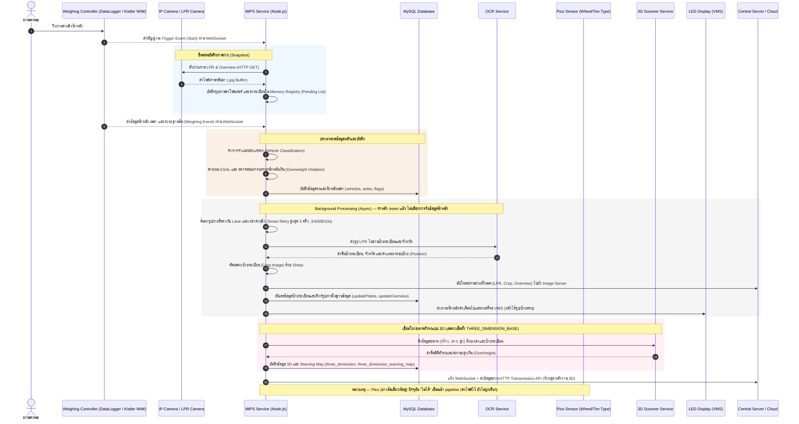

# 🚛 IMPS Service - Intermediate Station Service

**IMPS Service (Intermediate Station Service)** เป็นแอปพลิเคชัน Industrial IoT และ Middleware ที่พัฒนาด้วย Node.js สำหรับจัดการด่านชั่งน้ำหนักยานพาหนะ ทำหน้าที่เป็นตัวกลางเชื่อมต่อระหว่างฮาร์ดแวร์วัดน้ำหนัก, เครื่องสแกน 3 มิติ (3D Dimension Scanner), เซ็นเซอร์ตรวจสอบยางรถยนต์ (Raspberry Pi Pico), ระบบตรวจจับและอ่านป้ายทะเบียน (OCR/LPR), จอแสดงผล LED (VMS) และระบบจัดเก็บข้อมูลส่วนกลาง

---

## 🏗️ System Architecture & Data Flow

ระบบทำงานร่วมกันผ่านการเชื่อมต่อแบบ Real-time และการสืบค้นข้อมูลในฐานข้อมูล โดยมีแผนภาพการทำงานดังนี้:



---

## 🌟 Key Features (ฟีเจอร์หลัก)

1. **Hardware Controller Integration**
   - เชื่อมต่อกับ Weighing Controller **DataLogger** (Kistler WIM) ผ่าน WebSocket
   - การเชื่อมต่อมีระบบ Retry และ Reconnect แบบ Exponential Backoff (สูงสุด 60 วินาที) ป้องกัน Socket หลุดหรือ Timeouts เมื่อเครื่องมีโหลดสูง

2. **Visual Intelligence & Background OCR Processing**
   - เมื่อเกิด Trigger จะสั่งดึงภาพทันที และใช้ระบบประมวลผลพื้นหลัง (Background Worker) เพื่อไม่ให้ขัดขวางการรับข้อมูลน้ำหนักทาง WebSocket
   - มีระบบดึงภาพแบบ **Smart Retry & Backoff (สูงสุด 5 ครั้ง: 2/4/6/8/10 วินาที)** หากกล้องบันทึกช้า หากครบรอบแล้วยังไม่มีภาพ จะบันทึกข้อมูลโดยไม่มีรูปเพื่อกันข้อมูลหาย (ระบบ **ไม่มี** การสั่งถ่ายสด on-demand — ต้องพึ่ง Hardware Trigger เท่านั้น)
   - ตรวจจับป้ายทะเบียนผ่าน OCR API, ตัดรูปป้ายทะเบียน (Crop Image) ด้วย `sharp` และอัปโหลดไฟล์ภาพไปยังเซิร์ฟเวอร์เก็บรูปภาพ
   - หากกล้องอ่านป้ายได้ว่าเป็นรถที่ต้องยกเว้น (เช่น รถเก๋งส่วนบุคคล หรือ รถบัสขนาดเล็ก) ระบบจะทำการลบข้อมูลรถคันนั้นออกจากระบบโดยอัตโนมัติ

3. **Wheel / Tire Type Identification (Pico Integration)** — ⚠️ *ปัจจุบันยังไม่ได้เชื่อมเข้า pipeline*
   - มีโค้ดบริการ (`src/services/picoService.js`) สำหรับดึงสถานะล้อเดี่ยว/ล้อคู่ (Single/Dual Tire) จาก Raspberry Pi Pico แต่ **ฟังก์ชันนี้ยังไม่ถูกเรียกใช้จาก pipeline จริง** (คงไฟล์ไว้เผื่อ re-wire ภายหลัง) — สถานะล้อเดี่ยวที่บันทึกลง `axles` ปัจจุบันมาจากตาราง `single_tires` (`setSingleTire`) ไม่ใช่จาก Pico

4. **3D Dimension Scanner Integration**
   - เชื่อมโยงข้อมูลความกว้าง ความยาว และความสูงของยานพาหนะจากเครื่องสแกน 3D
   - ตรวจสอบและบันทึกความสูงเกินที่กำหนด พร้อมทำ Warning Mapping หากมีการทำผิดกฎ

5. **Straddling Merge Logic (ระบบควบรวมรถวิ่งคร่อมเลนความแม่นยำสูง)**
   - มีระบบพักข้อมูลใน Buffer และตรวจสอบรถวิ่งคร่อมเลน (Straddling) โดยจับคู่รถด้วยกลไกความแม่นยำสูง (High-Precision):
     * เปรียบเทียบเวลามาถึงของ 2 ครึ่ง — ไม่เกิน `straddling_time_diff` (**default 3 วินาที**)
     * บังคับต้องเป็นเลนที่อยู่ติดกันเท่านั้น (เลนต่างกันเท่ากับ 1)
     * **ยอมให้จำนวนเพลาต่างกันได้ตาม `straddling_axle_tol` (default 3 เพลา)** — เซ็นเซอร์ 2 เลนนับเพลาไม่ตรงกันได้
     * **Evidence gate:** เมื่อเพลาต่าง ≥2 ต้องมีหลักฐานยืนยัน — "ด้านศูนย์ตรงข้าม" (L0↔R0) **หรือ** WIM ติดธงคร่อมเลนทั้งคู่ (กันรวมผิดคัน)
     * **ใช้การจัดเรียงเพลาแบบ best-shift ตามตำแหน่งเพลาสะสม** (ความต่างไม่เกิน 30 ซม.) เมื่อจำนวนเพลาไม่เท่ากัน
     * ตรวจเช็คความเร็วใกล้เคียงกัน (ต่างกันไม่เกิน 15 กม./ชม.)
   - ยุบรวมเพลาซ้าย-ขวาเป็นแถวเดียว **แล้วคำนวณ class/violation/ESAL ใหม่บนน้ำหนักรวม** (ครึ่งคันมี class/น้ำหนักเกินผิด) พร้อม Log น้ำหนักล้อก่อน-หลังรวมเพื่อตรวจสอบได้
   - **Same-lane fragment combine:** ถ้า controller เลนเดียวตัดรถยาวเป็น 2 ท่อน จะรวมท่อนหน้า-หลังก่อน แล้วรอจับคู่ข้ามเลนต่อ
   - **align-null fallback:** Compare ผ่านแต่รวมเพลาไม่ลงตัว (เช่น 6vs5) → เลือกใบหนัก + mirror แทนปล่อย 2 ครึ่ง
   - **ชั้นกู้ที่ 2 (B2 cross-lane):** ครึ่งที่หมดเวลา buffer เช็คคู่ใน `recentVehicles` (เก็บรอย reading ที่ถูก filter ตัดด้วย) → `suppress-dup` (50ms) / `confirm-straddle` + mirror (250ms) ตามชนิดคู่ที่มี "สัญญาณคร่อมเลน"
   - **Type 2 mirror (คร่อมนุ่ม/ไหลทาง):** reading ฝั่งเดียวศูนย์ที่ไม่มีคู่ (เซ็นเซอร์เลนข้างไม่ออก record) → mirror เติมฝั่งหายเป็น **"ค่าประมาณ"** (`STRADDLE?`, `violation=0`) — ทุกเลน ไม่ต้องตั้ง edge-zone *(`mirror_edge_zones` เลิกใช้)*
   - รายละเอียดเต็ม: [docs/straddling-detection.md](docs/straddling-detection.md) · ตั้งค่า: [docs/config-guide.md](docs/config-guide.md)


6. **Dynamic Database Configuration**
   - ตรวจสอบการอัปเดตการตั้งค่าในตาราง `configuration` ทุกๆ 5 วินาที
   - หากพบความเปลี่ยนแปลง ระบบจะทำความสะอาดทรัพยากรตัวควบคุมเดิม (Stop Controller) และเริ่มต้นระบบใหม่ทันที (Auto-restart) โดยไม่ต้องรีสตาร์ทตัวเซอร์วิสทั้งหมด

7. **Automated Maintenance Cleanup**
   - รันเซอร์วิสล้างไฟล์ขยะและข้อมูลเก่าทุกเที่ยงคืนผ่าน `node-schedule`
   - ลบไฟล์รูปภาพในเครื่องและล้างข้อมูลแถวประวัติ (Snapshots) ที่มีอายุเก่ากว่าจำนวนวันที่ระบุใน `retention_days` เพื่อรักษาความจุฮาร์ดดิสก์

---

## 📂 Project Structure (โครงสร้างโปรเจค)

```bash
imps_service/
├── src/
│   ├── app.js                       # จุดเริ่มต้นของแอปพลิเคชัน จัดการ lifecycle ของแอปและตัวควบคุม
│   ├── app.config.js                # ไฟล์ตั้งค่าสำหรับรันบนระบบโปรดักชันด้วย PM2
│   ├── config/
│   │   └── db.js                    # จัดการการเชื่อมต่อฐานข้อมูล MySQL (ใช้ mysql2/promise pool)
│   ├── controllers/
│   │   ├── WSController.js          # คลาสแม่แบบ (Abstract Class) สำหรับจัดการ WebSocket Connections
│   │   └── DataLogger.js            # ตัวควบคุม DataLogger (Kistler WIM) — รวม straddling merge + pipeline logging
│   ├── services/
│   │   ├── configurationService.js  # ดึงค่าการตั้งค่าจาก DB และตรวจเช็คการอัปเดตการตั้งค่าทุก 5 วินาที
│   │   ├── vehiclesService.js       # จัดการ CRUD บันทึกข้อมูลรถ, เพลา, ป้ายทะเบียน และรูปภาพ
│   │   ├── transmissionService.js   # บริการส่งข้อมูลผลลัพธ์ผ่าน HTTP POST ไปยังระบบส่วนกลาง
│   │   ├── ledDisplayService.js     # ส่งคำเตือนและค่าน้ำหนักไปแสดงผลบนจอแสดงผล LED (VMS)
│   │   ├── picoService.js           # บริการสื่อสารดึงสถานะ Single/Dual Tires จาก Pico
│   │   ├── threeDimensionService.js # ดึงและบันทึกข้อมูลขนาดรถแบบ 3D และ Warning Map
│   │   ├── wsService.js             # ตัวส่งข้อมูลผลลัพธ์ผ่าน WebSocket ไคลเอนต์ไปยังเซิร์ฟเวอร์แสดงผล
│   │   └── snapshotCleanupService.js# บริการลบรูปภาพและฐานข้อมูลเก่าอัตโนมัติเวลาเที่ยงคืน
│   └── utils/
│       ├── logger.js                # จัดการการบันทึก Log ไฟล์ด้วย winston (แบ่งโฟลเดอร์รายวัน)
│       ├── perfMonitor.js           # ตัววัดประสิทธิภาพระบบ (Latencies, Counts, CPU, RAM)
│       ├── ocrService.js            # สื่อสารกับ OCR, ดึงค่าป้ายทะเบียน และ Crop รูปป้าย (gate ด้วย OCR_DEBUG)
│       ├── snapshotManager.js       # จัดการกล้องถ่ายภาพ, Smart Retry ดึงภาพ, อัปโหลดภาพ
│       ├── snapshotRegistry.js      # Registry ในเมมโมรี่ (30s TTL, prune throttle) เพื่อความเร็วในการดึงรูป
│       └── mappers/
│           ├── mapConfigurationKeys.js # แปลงคีย์การตั้งค่าจาก DB เป็น camelCase
│           └── mapDataLogger.js     # จำแนกรถ/ESAL/กฎคัดกรอง + straddling merge / edge-mirror / fragment combine
├── scripts/
│   ├── validate.js                  # ตรวจ syntax ทุกไฟล์ใน src/ (ใช้ใน npm test)
│   ├── test-mappers.js              # Unit test ของ mappers (ใช้ใน npm test)
│   ├── find-unused.js               # ค้นหาโค้ด/ไฟล์ที่ไม่ถูกใช้งาน
│   └── generate-snap-doc-pdf.js     # สคริปต์สร้างไฟล์คู่มือ/รายงานด้วย Puppeteer
├── public/                          # แหล่งเก็บรูปภาพชั่วคราวก่อนอัปโหลด
├── .env.example                     # ไฟล์ตัวอย่างสำหรับการตั้งค่า Environment Variables
├── package.json                     # ไฟล์จัดการ Dependencies และรันคำสั่ง
└── README.md                        # คู่มือการใช้งานโปรเจค (ไฟล์นี้)
```

---

## 🛠️ Prerequisites & Installation (การติดตั้ง)

### 1. สิ่งที่ต้องมีในระบบ
- **Node.js** (เวอร์ชัน v14 ขึ้นไป แนะนำ v18 LTS หรือใหม่กว่า)
- **MySQL Database Server**
- เซิร์ฟเวอร์กล้อง/OCR และ ระบบรับสัญญาณน้ำหนักที่พร้อมใช้งาน

### 2. ขั้นตอนการติดตั้ง
ติดตั้ง dependencies ด้วย npm:
```bash
npm install
```

### 3. ตั้งค่าระบบด้วย `.env`
คัดลอกไฟล์ `.env.example` เป็น `.env` และกรอกข้อมูลให้ตรงกับหน้างานจริง:
```bash
cp .env.example .env
```

| ตัวแปรตั้งค่า | คำอธิบาย | ตัวอย่างค่า |
| :--- | :--- | :--- |
| `DB_HOST` | ที่อยู่ของเซิร์ฟเวอร์ MySQL | `localhost` |
| `DB_USER` | ชื่อผู้ใช้ MySQL | `root` |
| `DB_PASSWORD` | รหัสผ่าน MySQL | `1234` |
| `DB_NAME` | ชื่อฐานข้อมูลของระบบ IMPS | `imps_db` |
| `WS_SERVER_URL` | WebSocket Server สำหรับส่งผลลัพธ์เรียลไทม์ | `ws://localhost:4000/vehicle/receive` |
| `IMAGE_LPR_UPLOAD_URL` | API สำหรับอัปโหลดรูปป้ายทะเบียน (LPR) | `http://localhost:3003/api/upload/lpr` |
| `IMAGE_CROP_UPLOAD_URL` | API สำหรับอัปโหลดรูปเฉพาะป้ายที่ถูกตัด (Crop) | `http://localhost:3003/api/upload/crop` |
| `IMAGE_OVERVIEW_UPLOAD_URL` | API สำหรับอัปโหลดภาพมุมกว้าง (Overview) | `http://localhost:3003/api/upload/overview` |
| `VMS_URL` | ⚠️ *Deprecated/ไม่ถูกใช้* — โค้ดส่ง VMS ด้วย `led_url` จากตาราง `configuration` ใน DB ไม่ใช่ env นี้ | `http://localhost:3006/api/vms` |
| `TRANSMISSION_URL` | API ส่วนกลางสำหรับรับส่งข้อมูลรถชั่งน้ำหนัก | `http://localhost:3007/api/vehicles/data-transmission` |
| `THREE_DIMENSION_BASE` | URL บริการระบบสแกน 3D | `http://10.1.28.20:3210` |
| `THREE_DIMENSION_DELAY` | หน่วงเวลาดึงข้อมูล 3D (มิลลิวินาที) | `5000` |
| `THREE_DIMENSION_MAXIMUM_HEIGHT`| ความสูงจำกัดสูงสุดของยานพาหนะ (เซนติเมตร) | `350` |
| `PICO_BASE` | URL ของเซ็นเซอร์ยางล้อ Pico | `http://192.168.145.110:8000` |
| `SNAP_MATCH_DB_POLL_MS` | ความถี่ในการตรวจสอบภาพถ่ายในฐานข้อมูลระหว่างรอดึงรูป (ms) | `1000` |
| `SNAP_MATCH_MAX_WAIT_MS` | ระยะเวลารอภาพจากกล้องถ่ายภาพสูงสุด (ms) | `3000` |
| `TRIGGER_HISTORY_WINDOW_MS` | ช่วงเวลาตรวจสอบประวัติการ Trigger กล้องย้อนหลังเพื่อหลีกเลี่ยงการถ่ายภาพสด (ms) | `3000` |
| `METRICS_INTERVAL_MS` | ช่วงเวลารอบการบันทึกสรุปข้อมูลสถิติประสิทธิภาพการทำงาน (ms) | `300000` |
| `METRICS_FORMAT` | รูปแบบของ Log แสดงผลลัพธ์ประสิทธิภาพ: `pretty` หรือ `compact` | `pretty` |
| `SNAP_MATCH_BACK_MS` | ช่วงเวลาดึงรูปภาพแบบย้อนหลังกรณี Override จากค่าตั้งต้น (ms) | `2000` |
| `SNAP_MATCH_FWD_MS` | ช่วงเวลาดึงรูปภาพแบบล่วงหน้ากรณี Override จากค่าตั้งต้น (ms) | `8000` |
| `TRIGGER_DEBOUNCE_MS` | Debounce trigger ต่อเลน (ซ้าย+ขวาของคันเดียวยิงแทบพร้อมกัน → ถ่าย snapshot ใบเดียว) | `250` |
| `OCR_PREPROCESS` | เปิด pre-process ภาพก่อนส่ง OCR (sharpen/denoise/normalise) `1`=เปิด, ไม่ใส่=ปิด | `0` |
| `OCR_DEBUG` | เปิด log วินิจฉัย OCR (`[OCR][raw]` response เต็ม + `[OCR][Crop]` พิกัด) `1`=เปิด, ไม่ใส่=ปิด | `0` |

> **หมายเหตุ:** การจูน straddling อยู่ใน **ตาราง `configuration` ของ DB** (`straddling_*`, อ่านใหม่ทุก 5 วิ) + **env** (`STRADDLE_MATCH_MS`/`STRADDLE_CONFIRM_MS`/`STRADDLE_PARTNER_FLOOR`, ตอน restart) · ดู [docs/config-guide.md](docs/config-guide.md)

---

## 🚀 Running the Service (การเริ่มต้นรันระบบ)

### โหมดพัฒนา (Development Mode)
รันแอปพลิเคชันพร้อมระบบ Auto-reload เมื่อไฟล์เปลี่ยนโค้ด (ใช้ `nodemon`):
```bash
npm run dev
```

### โหมดใช้งานจริง (Production Mode)
รันแอปพลิเคชันเป็นเบื้องหลังและดูแลการรันด้วย **PM2**:
```bash
npm run prod
```
*หมายเหตุ: สามารถตรวจสอบสถานะการทำงานและ log ได้โดยใช้คำสั่ง `pm2 status` หรือ `pm2 logs`*

---

## 💾 Database Schema (โครงสร้างฐานข้อมูลเบื้องต้น)

ระบบชั่งน้ำหนักมีการเก็บบันทึกข้อมูลในตารางหลักดังนี้:

- **`configuration`**: เก็บการตั้งค่าทางกายภาพของด่านชั่ง (IP ด่าน, URL กล้อง, IP ป้ายไฟ, ข้อจำกัดขนาด, จำนวนวันเก็บภาพ)
- **`vehicles`**: บันทึกข้อมูลคันรถหลัก น้ำหนักรวม (GVW), ความเร็ว, เลนวิ่ง, วันที่-เวลาชั่ง, และสถานะการบรรทุกเกินน้ำหนัก
- **`axles`**: บันทึกน้ำหนักแยกแต่ละเพลา, น้ำหนักซ้าย-ขวา, ระยะฐานล้อ (wheelbase), และข้อมูลยางเดี่ยว/ยางคู่
- **`axles_after_allowance`**: บันทึกข้อมูลการคำนวณผ่อนปรนน้ำหนักบรรทุก
- **`plates`**: เก็บป้ายทะเบียน จังหวัด และพาธไฟล์รูปถ่ายป้ายทะเบียน
- **`images`**: เก็บพาธและ URL ของไฟล์รูปถ่ายภาพรวม (Overview Image)
- **`flags`**: เก็บรหัสประเภทรหัสข้อผิดพลาด (Errors) และรหัสคำเตือน (Warnings) ของรถคันนั้นๆ
- **`three_dimension`**: เก็บมิติของรถที่สแกนได้ กว้าง ยาว สูง และสถานะสูงเกินกำหนด
- **`three_dimension_warning_map`**: บันทึกจับคู่สัญญาณเตือนของตาราง 3D

---

## 🧹 Maintenance & Performance (การบำรุงรักษาและประสิทธิภาพ)
- **Logs System**: ล็อกไฟล์จะถูกสร้างขึ้นมาในไดเรกทอรี `logs/` โดยจำแนกตามประเภทและแบ่งเป็นรายวัน
- **Performance Monitoring**: มีระบบ `perfMonitor` คอยนับจำนวนรถ (Counts), วัดเวลาประมวลผล (Timings p50/p95), และตรวจสอบสุขภาพระบบ (CPU/RAM/Event Loop) สรุปลง Log ทุกๆ 5 นาที
- **Hot-path Optimizations**: snapshot registry กวาด buffer แบบ throttle (ทุก ~5s ไม่ใช่ทุกรูป), insert `axles`/`axles_after_allowance`/`flags` แบบ batch ต่อ transaction, และ OCR ไม่ decode ภาพซ้ำตอน crop — ลดงานบน main thread/รอบ DB ต่อคัน
- **Midnight Cleanup**: บริการ `snapshotCleanupService.js` จะลบรูปภาพในเครื่องและแถวชั่วคราวในตาราง `snapshots` ที่เก่ากว่าวันที่ตั้งค่าไว้ในฐานข้อมูล (`retention_days`) เพื่อป้องกันไม่ให้พื้นที่จัดเก็บของเซิร์ฟเวอร์เต็ม

---

## 📷 ความครบถ้วนของภาพถ่าย (Smart Retry)

### ความสำคัญ
ในระบบชั่งน้ำหนักแบบเคลื่อนที่ (WIM) รูปมุมกว้าง (Overview) และรูปป้ายทะเบียน (LPR) เป็น **หลักฐานทางกฎหมายเมื่อบรรทุกน้ำหนักเกิน** หากรถวิ่งเบียด/คร่อมเลน หรือไม่เหยียบเซ็นเซอร์ทริกเกอร์ กล้องอาจไม่ถูกสั่งถ่าย ทำให้รายงานขาดภาพ

### พฤติกรรมจริงของระบบ
1. **บันทึกก่อน:** บันทึกข้อมูลน้ำหนักลง DB ทันที (~20ms) งานหารูป/OCR ทำเป็น Background
2. **Smart Retry:** `waitForImages` วนเรียก `findAndProcessSnapshots` ซ้ำสูงสุด 5 ครั้ง (2/4/6/8/10 วินาที) รอจน snapshot ถูก register
3. **บันทึกแม้รูปไม่ครบ:** ถ้าครบรอบแล้วยังไม่มีรูป ระบบจะเก็บข้อมูลไว้ (log เป็น warning) แทนที่จะทิ้ง เพื่อกันข้อมูลหาย

> **หมายเหตุสำคัญ:** ระบบ **ไม่มี** การสั่งกล้องถ่ายสดแบบ on-demand — ต้องพึ่งสัญญาณ Trigger จากฮาร์ดแวร์เท่านั้น รถที่ไม่เหยียบทริกเกอร์ (เช่น คร่อมเลนเลยแท่งซ้าย) จะได้ระเบียนที่ป้ายเป็น `N/A` การแก้อยู่ที่ **ระดับอุปกรณ์** (เปิด trigger channel ที่ 2 บนตัว WIM Logger) ไม่ใช่ที่ซอฟต์แวย์ — ตัวแปร `this.lastTriggerTimes` ยังถูกบันทึกไว้แต่ปัจจุบันไม่ได้ถูกใช้ทำ fallback
