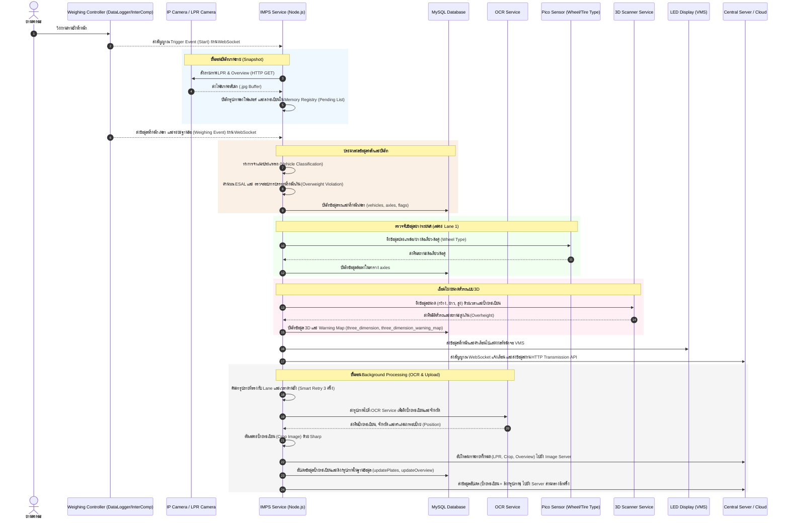

# 🚛 IMPS Service - Intermediate Station Service

**IMPS Service (Intermediate Station Service)** เป็นแอปพลิเคชัน Industrial IoT และ Middleware ที่พัฒนาด้วย Node.js สำหรับจัดการด่านชั่งน้ำหนักยานพาหนะ ทำหน้าที่เป็นตัวกลางเชื่อมต่อระหว่างฮาร์ดแวร์วัดน้ำหนัก, เครื่องสแกน 3 มิติ (3D Dimension Scanner), เซ็นเซอร์ตรวจสอบยางรถยนต์ (Raspberry Pi Pico), ระบบตรวจจับและอ่านป้ายทะเบียน (OCR/LPR), จอแสดงผล LED (VMS) และระบบจัดเก็บข้อมูลส่วนกลาง

---

## 🏗️ System Architecture & Data Flow

ระบบทำงานร่วมกันผ่านการเชื่อมต่อแบบ Real-time และการสืบค้นข้อมูลในฐานข้อมูล โดยมีแผนภาพการทำงานดังนี้:



---

## 🌟 Key Features (ฟีเจอร์หลัก)

1. **Hardware Controller Integration**
   - รองรับการเชื่อมต่อกับ Weighing Controllers ยอดนิยมในอุตสาหกรรม ได้แก่ **DataLogger** (โปรโตคอลหลัก) และ **InterComp** (ทางเลือก)
   - การเชื่อมต่อมีระบบ Retry และ Reconnect แบบ Exponential Backoff (สูงสุด 60 วินาที) ป้องกัน Socket หลุดหรือ Timeouts เมื่อเครื่องมีโหลดสูง

2. **Visual Intelligence & Background OCR Processing**
   - เมื่อเกิด Trigger จะสั่งดึงภาพทันที และใช้ระบบประมวลผลพื้นหลัง (Background Worker) เพื่อไม่ให้ขัดขวางการรับข้อมูลน้ำหนักทาง WebSocket
   - มีระบบดึงภาพแบบ **Smart Retry & Backoff (สูงสุด 3 ครั้ง)** หากกล้องบันทึกช้า
   - **ระบบสำรองสั่งถ่ายภาพแบบไม่มีดีเลย์ (Zero-Delay On-Demand Trigger Fallback):** หากเกิดกรณีเซ็นเซอร์หลักไม่กระตุ้นสัญญาณไฟถ่ายรูป (Hardware Trigger ล้มเหลว/รถเบียดคร่อมเลน) ระบบจะตรวจสอบประวัติการ Trigger ย้อนหลังในหน่วยความจำ 15 วินาที หากพบว่าไม่มีสัญญาณ Trigger เข้ามาเลย ระบบจะทำการสั่งกล้องถ่ายภาพแบบด่วนทันทีโดยไม่มีการรอหน่วงเวลาค้นหาภาพ 5 วินาที เพื่อเพิ่มโอกาสสูงสุดในการจับภาพป้ายทะเบียนและภาพมุมกว้างของรถขณะเคลื่อนที่ออก
   - ตรวจจับป้ายทะเบียนผ่าน OCR API, ตัดรูปป้ายทะเบียน (Crop Image) ด้วย `sharp` และอัปโหลดไฟล์ภาพไปยังเซิร์ฟเวอร์เก็บรูปภาพ
   - หากกล้องอ่านป้ายได้ว่าเป็นรถที่ต้องยกเว้น (เช่น รถเก๋งส่วนบุคคล หรือ รถบัสขนาดเล็ก) ระบบจะทำการลบข้อมูลรถคันนั้นออกจากระบบโดยอัตโนมัติ

3. **Wheel / Tire Type Identification (Pico Integration)**
   - เชื่อมต่อกับ Raspberry Pi Pico สำหรับระบุประเภทล้อหน้า/หลังว่าเป็นล้อเดี่ยวหรือล้อคู่ (Single / Dual Tire) และเก็บลงฐานข้อมูลเพื่อวิเคราะห์ความเสียหายผิวทาง

4. **3D Dimension Scanner Integration**
   - เชื่อมโยงข้อมูลความกว้าง ความยาว และความสูงของยานพาหนะจากเครื่องสแกน 3D
   - ตรวจสอบและบันทึกความสูงเกินที่กำหนด พร้อมทำ Warning Mapping หากมีการทำผิดกฎ

5. **Straddling Merge Logic**
   - มีระบบพักข้อมูลและตรวจสอบรถวิ่งคล่อมเลน (Straddling) โดยจับคู่รถที่วิ่งผ่านในเวลาใกล้เคียงกันที่มีเพลาเท่ากัน เพื่อยุบรวมข้อมูล (Merge) ให้อยู่ในแถวเดียวกันอย่างถูกต้อง

6. **Dynamic Database Configuration**
   - ตรวจสอบการอัปเดตการตั้งค่าในตาราง `configuration` ทุกๆ 5 วินาที
   - หากพบความเปลี่ยนแปลง ระบบจะทำความสะอาดทรัพยากรตัวควบคุมเดิม (Stop Controller) และเริ่มต้นระบบใหม่ทันที (Auto-restart) โดยไม่ต้องรีสตาร์ทตัวเซอร์วิสทั้งหมด

7. **Automated Maintenance Cleanup**
   - รันเซอร์วิสล้างไฟล์ขยะและข้อมูลเก่าทุกเที่ยงคืนผ่าน `node-schedule`
   - ลบไฟล์รูปภาพในเครื่องและล้างข้อมูลแถวประวัติ (Snapshots) ที่มีอายุเก่ากว่าจำนวนวันที่ระบุใน `retention_days` เพื่อรักษาความจุฮาร์ดดิสก์

---

## 📂 Project Structure (โครงสร้างโปรเจค)

```bash
imps_service/
├── src/
│   ├── app.js                       # จุดเริ่มต้นของแอปพลิเคชัน จัดการ lifecycle ของแอปและตัวควบคุม
│   ├── app.config.js                # ไฟล์ตั้งค่าสำหรับรันบนระบบโปรดักชันด้วย PM2
│   ├── config/
│   │   └── db.js                    # จัดการการเชื่อมต่อฐานข้อมูล MySQL (ใช้ mysql2/promise pool)
│   ├── controllers/
│   │   ├── WSController.js          # คลาสแม่แบบ (Abstract Class) สำหรับจัดการ WebSocket Connections
│   │   ├── DataLogger.js            # ตัวควบคุมสำหรับเชื่อมต่อ DataLogger weighing controller
│   │   └── InterComp.js             # ตัวควบคุมสำหรับเชื่อมต่อ InterComp weighing controller
│   ├── services/
│   │   ├── configurationService.js  # ดึงค่าการตั้งค่าจาก DB และตรวจเช็คการอัปเดตการตั้งค่าทุก 5 วินาที
│   │   ├── vehiclesService.js       # จัดการ CRUD บันทึกข้อมูลรถ, เพลา, ป้ายทะเบียน และรูปภาพ
│   │   ├── transmissionService.js   # บริการส่งข้อมูลผลลัพธ์ผ่าน HTTP POST ไปยังระบบส่วนกลาง
│   │   ├── ledDisplayService.js     # ส่งคำเตือนและค่าน้ำหนักไปแสดงผลบนจอแสดงผล LED (VMS)
│   │   ├── picoService.js           # บริการสื่อสารดึงสถานะ Single/Dual Tires จาก Pico
│   │   ├── threeDimensionService.js # ดึงและบันทึกข้อมูลขนาดรถแบบ 3D และ Warning Map
│   │   ├── wsService.js             # ตัวส่งข้อมูลผลลัพธ์ผ่าน WebSocket ไคลเอนต์ไปยังเซิร์ฟเวอร์แสดงผล
│   │   └── snapshotCleanupService.js# บริการลบรูปภาพและฐานข้อมูลเก่าอัตโนมัติเวลาเที่ยงคืน
│   └── utils/
│       ├── index.js                 # ส่งออกตัวช่วยระบบ (Mappers, Loggers)
│       ├── logger.js                # จัดการการบันทึก Log ไฟล์ด้วย winston (แบ่งโฟลเดอร์รายวัน)
│       ├── ocrService.js            # สื่อสารกับ OCR, ดึงค่าป้ายทะเบียน และทำการ Crop รูปภาพป้ายทะเบียน
│       ├── snapshot.js              # จัดการเขียนไฟล์ภาพ และประมวลผลไฟล์ภาพในระบบ
│       ├── snapshotManager.js       # จัดการเรื่องกล้องถ่ายภาพ, Smart Retry ดึงภาพ, อัปโหลดภาพ
│       ├── snapshotRegistry.js      # ตัวเก็บ Registry ในเมมโมรี่เพื่อความเร็วในการดึงรูป
│       └── mappers/
│           ├── mapConfigurationKeys.js # แปลงรูปแบบคีย์ของการตั้งค่าจากฐานข้อมูลให้เป็น camelCase
│           ├── mapDataLogger.js     # จัดการคำนวณและจำแนกรถ รวมถึงกฎคัดกรองสำหรับ DataLogger
│           └── mapInterComp.js      # จัดการคำนวณและจำแนกรถ รวมถึงกฎคัดกรองสำหรับ InterComp
├── scripts/
│   └── generate-snap-doc-pdf.js     # สคริปต์สร้างไฟล์คู่มือและรายงานการแก้ไขด้วย Puppeteer
├── public/                          # แหล่งเก็บรูปภาพชั่วคราวก่อนอัปโหลด
├── .env.example                     # ไฟล์ตัวอย่างสำหรับการตั้งค่า Environment Variables
├── package.json                     # ไฟล์จัดการ Dependencies และรันคำสั่ง
└── README.md                        # คู่มือการใช้งานโปรเจค (ไฟล์นี้)
```

---

## 🛠️ Prerequisites & Installation (การติดตั้ง)

### 1. สิ่งที่ต้องมีในระบบ
- **Node.js** (เวอร์ชัน v14 ขึ้นไป แนะนำ v18 LTS หรือใหม่กว่า)
- **MySQL Database Server**
- เซิร์ฟเวอร์กล้อง/OCR และ ระบบรับสัญญาณน้ำหนักที่พร้อมใช้งาน

### 2. ขั้นตอนการติดตั้ง
ติดตั้ง dependencies ด้วย npm:
```bash
npm install
```

### 3. ตั้งค่าระบบด้วย `.env`
คัดลอกไฟล์ `.env.example` เป็น `.env` และกรอกข้อมูลให้ตรงกับหน้างานจริง:
```bash
cp .env.example .env
```

| ตัวแปรตั้งค่า | คำอธิบาย | ตัวอย่างค่า |
| :--- | :--- | :--- |
| `DB_HOST` | ที่อยู่ของเซิร์ฟเวอร์ MySQL | `localhost` |
| `DB_USER` | ชื่อผู้ใช้ MySQL | `root` |
| `DB_PASSWORD` | รหัสผ่าน MySQL | `1234` |
| `DB_NAME` | ชื่อฐานข้อมูลของระบบ IMPS | `imps_db` |
| `WS_SERVER_URL` | WebSocket Server สำหรับส่งผลลัพธ์เรียลไทม์ | `ws://localhost:4000/vehicle/receive` |
| `IMAGE_LPR_UPLOAD_URL` | API สำหรับอัปโหลดรูปป้ายทะเบียน (LPR) | `http://localhost:3003/api/upload/lpr` |
| `IMAGE_CROP_UPLOAD_URL` | API สำหรับอัปโหลดรูปเฉพาะป้ายที่ถูกตัด (Crop) | `http://localhost:3003/api/upload/crop` |
| `IMAGE_OVERVIEW_UPLOAD_URL` | API สำหรับอัปโหลดภาพมุมกว้าง (Overview) | `http://localhost:3003/api/upload/overview` |
| `VMS_URL` | API สำหรับขับสัญญาณป้ายไฟ LED | `http://localhost:3006/api/vms` |
| `TRANSMISSION_URL` | API ส่วนกลางสำหรับรับส่งข้อมูลรถชั่งน้ำหนัก | `http://localhost:3007/api/vehicles/data-transmission` |
| `THREE_DIMENSION_BASE` | URL บริการระบบสแกน 3D (ลบออกหากไม่มีสแกนเนอร์) | `http://10.1.28.20:3210` |
| `THREE_DIMENSION_DELAY` | หน่วงเวลาดึงข้อมูล 3D (มิลลิวินาที) | `5000` |
| `THREE_DIMENSION_MAXIMUM_HEIGHT`| ความสูงจำกัดสูงสุดของยานพาหนะ (เซนติเมตร) | `350` |
| `PICO_BASE` | URL ของเซ็นเซอร์ยางล้อ Pico (ลบออกหากไม่มี) | `http://192.168.145.110:8000` |
| `SNAP_MATCH_POLL_MS` | ความถี่ในการวนลูปหาภาพถ่ายคู่กับเวลาชั่ง (ms) | `150` |
| `SNAP_MATCH_MAX_WAIT_MS` | ระยะเวลารอภาพจากกล้องถ่ายภาพสูงสุด (ms) | `3000` |

---

## 🚀 Running the Service (การเริ่มต้นรันระบบ)

### โหมดพัฒนา (Development Mode)
รันแอปพลิเคชันพร้อมระบบ Auto-reload เมื่อไฟล์เปลี่ยนโค้ด (ใช้ `nodemon`):
```bash
npm run dev
```

### โหมดใช้งานจริง (Production Mode)
รันแอปพลิเคชันเป็นเบื้องหลังและดูแลการรันด้วย **PM2**:
```bash
npm run prod
```
*หมายเหตุ: สามารถตรวจสอบสถานะการทำงานและ log ได้โดยใช้คำสั่ง `pm2 status` หรือ `pm2 logs`*

---

## 💾 Database Schema (โครงสร้างฐานข้อมูลเบื้องต้น)

ระบบชั่งน้ำหนักมีการเก็บบันทึกข้อมูลในตารางหลักดังนี้:

- **`configuration`**: เก็บการตั้งค่าทางกายภาพของด่านชั่ง (IP ด่าน, URL กล้อง, IP ป้ายไฟ, ข้อจำกัดขนาด, จำนวนวันเก็บภาพ)
- **`vehicles`**: บันทึกข้อมูลคันรถหลัก น้ำหนักรวม (GVW), ความเร็ว, เลนวิ่ง, วันที่-เวลาชั่ง, และสถานะการบรรทุกเกินน้ำหนัก
- **`axles`**: บันทึกน้ำหนักแยกแต่ละเพลา, น้ำหนักซ้าย-ขวา, ระยะฐานล้อ (wheelbase), และข้อมูลยางเดี่ยว/ยางคู่
- **`axles_after_allowance`**: บันทึกข้อมูลการคำนวณผ่อนปรนน้ำหนักบรรทุก
- **`plates`**: เก็บป้ายทะเบียน จังหวัด และพาธไฟล์รูปถ่ายป้ายทะเบียน
- **`images`**: เก็บพาธและ URL ของไฟล์รูปถ่ายภาพรวม (Overview Image)
- **`flags`**: เก็บรหัสประเภทรหัสข้อผิดพลาด (Errors) และรหัสคำเตือน (Warnings) ของรถคันนั้นๆ
- **`three_dimension`**: เก็บมิติของรถที่สแกนได้ กว้าง ยาว สูง และสถานะสูงเกินกำหนด
- **`three_dimension_warning_map`**: บันทึกจับคู่สัญญาณเตือนของตาราง 3D

---

## 🧹 Maintenance (การบำรุงรักษา)
- **Logs System**: ล็อกไฟล์จะถูกสร้างขึ้นมาในไดเรกทอรี `logs/` โดยจำแนกตามประเภทและแบ่งเป็นรายวัน
- **Midnight Cleanup**: บริการ `snapshotCleanupService.js` จะลบรูปภาพในเครื่องและแถวชั่วคราวในตาราง `snapshots` ที่เก่ากว่าวันที่ตั้งค่าไว้ในฐานข้อมูล (`retention_days`) เพื่อป้องกันไม่ให้พื้นที่จัดเก็บของเซิร์ฟเวอร์เต็ม

---

## 📷 หลักการและสถาปัตยกรรมระบบสำรองเมื่อขาดสัญญาณ Trigger (Zero-Delay On-Demand Trigger Fallback)

### ความสำคัญของระบบสำรอง
ในระบบชั่งน้ำหนักยานพาหนะแบบเคลื่อนที่ (WIM) รูปถ่ายมุมกว้าง (Overview) และรูปทะเบียน (LPR) เป็นสิ่งจำเป็นอย่างยิ่งในการระบุตัวตนและใช้เป็น **หลักฐานทางกฎหมายเมื่อบรรทุกน้ำหนักเกิน** 
หากเกิดสถานการณ์ที่รถวิ่งเบียดขอบเลน วิ่งคร่อมระหว่างเลน หรือเซ็นเซอร์หน้างานขัดข้อง ทำให้**ไม่มีสัญญาณ Trigger (force-event) ส่งมาสั่งถ่ายรูป** ตัวรถจะไม่ถูกถ่ายรูป ทำให้รายงานที่ได้ขาดข้อมูลภาพถ่าย ซึ่งทางราชการจะไม่สามารถนำข้อมูลนี้ไปเปรียบเทียบปรับได้

### หลักการทำงานโดยละเอียด (Working Principles)
ระบบซอฟต์แวร์ IMPS ได้รับการปรับปรุงเพื่อแก้ปัญหานี้โดยไม่ก่อให้เกิดการหน่วงเวลาประมวลผลปกติ:

1. **การบันทึกสถานะเรียลไทม์ (Trigger Tracking Map):**
   * คลาสตัวควบคุม `DataLogger` และ `InterComp` จะสร้าง `this.lastTriggerTimes = new Map()` เพื่อบันทึกเวลาที่ได้รับสัญญาณ Trigger (`force-event` หรือ `TriggerTime`) ล่าสุดของแต่ละเลน
2. **การวินิจฉัยความขัดข้องของฮาร์ดแวร์ (Hardware Fault Diagnostics):**
   * เมื่อได้รับสัญญาณข้อมูลการชั่งน้ำหนักเสร็จสิ้น (Weighing Event) ระบบจะเข้าสู่ฟังก์ชันค้นหาภาพ `findAndProcessSnapshots`
   * ระบบจะคำนวณระยะห่างระหว่างเวลาประมวลผลปัจจุบัน กับเวลา Trigger ล่าสุดของเลนนั้น:
     $$\Delta t = \text{Time}_{\text{Now}} - \text{Time}_{\text{LastTrigger}}$$
   * หาก $\Delta t \le 15$ วินาที: แสดงว่าเซ็นเซอร์ฮาร์ดแวร์ทำงานปกติ ระบบจะใช้โหมดวนหาภาพแบบมีระยะเวลารอ 5 วินาทีปกติ (`findSnapshots`) เพื่อเปิดโอกาสให้กระบวนการบันทึกไฟล์ภาพของกล้องเสร็จสมบูรณ์
   * หาก $\Delta t > 15$ วินาที หรือไม่มีประวัติการบันทึกเลย: ระบบวินิจฉัยทันทีว่า **เซ็นเซอร์ไม่กระตุ้นการถ่ายรูป (No Trigger)**
3. **การข้ามการดีเลย์และการถ่ายสดทันที (Zero-Delay Live Snapshot):**
   * ในกรณีที่วินิจฉัยว่าระบบไม่มี Trigger ระบบจะข้ามขั้นตอนการหน่วงเวลา 5 วินาทีของ `findSnapshots` ทันที แล้วเรียกฟังก์ชันเช็คแบบตรวจสอบครั้งเดียว (`_findSnapshotOnce`) 
   * เมื่อตรวจสอบครั้งเดียวแล้วไม่พบภาพในระบบ ซอฟต์แวร์จะส่งคำสั่ง HTTP GET ไปที่กล้องเพื่อ **ถ่ายภาพสดแบบด่วน ณ วินาทีนั้นทันที** และทำการ OCR/อัปโหลดภาพเข้าสู่กระบวนการต่อไปในหน่วยมิลลิวินาที ทำให้สามารถถ่ายภาพตัวรถไว้ได้ก่อนที่รถจะเคลื่อนเลยมุมกล้องไป
