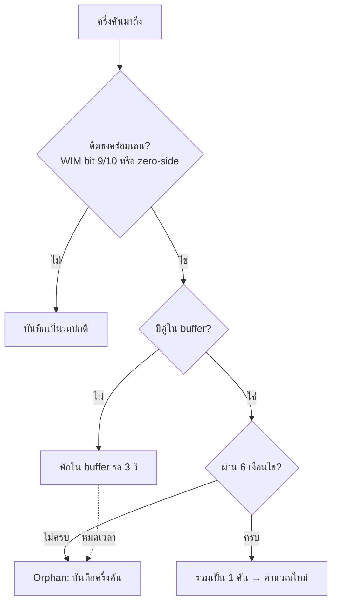

# การจับรถคร่อมเลน (Straddling Detection) — IMPS WIM V2

> เอกสารนี้อธิบายว่าระบบจับ "รถที่วิ่งคร่อมเส้นแบ่งเลน" แล้วรวมเป็นคันเดียวได้อย่างไร
> อ่านส่วน **A–C** ถ้าเป็นทีมหน้างาน/ปฏิบัติการ · อ่านต่อ **D–F** ถ้าเป็น dev/ดูแลโค้ด

---

## A. ปัญหาที่แก้ (เข้าใจใน 30 วินาที)

สถานีมี 3 เลน แต่ละเลนมีเครื่องชั่งแยกกัน เมื่อรถวิ่ง **คร่อมเส้นแบ่งเลน** (ล้อซ้ายอยู่เลนหนึ่ง ล้อขวาอีกเลน) เครื่องชั่งสองตัวต่างคนต่างชั่งได้ **"ครึ่งคัน"** คนละใบ

ถ้าระบบรวม 2 ครึ่งไม่ติด → กลายเป็น **"2 คันครึ่ง"** ในฐานข้อมูล = น้ำหนักผิด ตรวจน้ำหนักเกินไม่ได้ และนับจำนวนรถเพี้ยน

**เป้าหมาย:** เอา 2 ครึ่งที่เป็นรถคันเดียวกัน มารวมเป็น **1 record** ที่ถูกต้อง

---

## B. หลักการทำงาน (ภาษาคน)

### ฟิสิกส์: ทำไมเกิด "ลายเซ็น" ที่บอกได้ว่าเป็นรถคร่อมเลน

```
          เลน 2            |            เลน 3
   [ ซ้าย ][ ขวา ]         |     [ ซ้าย ][ ขวา ]
            ●●  ┌───────────┼───────────┐  ●●
            ●●  │      รถคันเดียว         │  ●●
            ●●  └───────────┼───────────┘  ●●
       ล้อซ้ายของรถ         |         ล้อขวาของรถ
   เลน2 อ่านได้แต่ฝั่งขวา    |   เลน3 อ่านได้แต่ฝั่งซ้าย
   → ฝั่งซ้าย = 0  (L0)     |   → ฝั่งขวา = 0  (R0)
```

รถคร่อมเลนจริงจะทิ้ง "ลายเซ็น" ตรงข้ามกันเสมอ: **เลนซ้าย = L0** คู่กับ **เลนขวา = R0**
นี่คือหลักฐานทางฟิสิกส์ว่าเป็นรถคันเดียว ไม่ใช่ 2 คันบังเอิญวิ่งพร้อมกัน

### ขั้นตอนการจับคู่

1. ครึ่งคันใบแรกมาถึง → **พักไว้ใน buffer รอคู่ 3 วินาที**
2. ครึ่งคันใบที่สองมา → เทียบกับใบที่รออยู่ด้วย **6 เงื่อนไข** (ดูข้อ C)
3. ผ่านครบ → **รวมเป็นคันเดียว** (ต่อจิ๊กซอว์เพลา → คำนวณน้ำหนัก/คลาสใหม่)
4. ไม่ผ่าน / ไม่มีคู่ใน 3 วิ → บันทึกเป็น "ครึ่งคัน" (orphan)



---

## C. 6 เงื่อนไขจับคู่ (ต้องผ่านครบทุกข้อ)

| # | เงื่อนไข | ค่าเริ่มต้น | ความหมาย |
|---|---|---|---|
| 1 | เวลาห่างกัน | ≤ 3 วินาที | 2 ครึ่งของคันเดียวมาถึงพร้อมกัน |
| 2 | เลนติดกัน | หมายเลขต่าง 1 | คร่อมได้เฉพาะเลนข้างๆ |
| 3 | ฐานล้อตรงกัน | ≤ 30 ซม. | ระยะห่างเพลาเหมือนกัน |
| 4 | ความเร็วต่าง | ≤ 15 กม./ชม. | วิ่งความเร็วเดียวกัน |
| 5 | จำนวนเพลาต่าง | ≤ 3 เพลา | เซ็นเซอร์ 2 เลนนับเพลาไม่ตรงกันได้ |
| 6 | หลักฐานยืนยัน | L0↔R0 **หรือ** WIM ติดธงทั้งคู่ | ใช้เมื่อเพลาต่าง ≥2 (กันรวมผิดคัน) |

> **หัวใจที่แก้:** เดิมข้อ 5 ยอมให้เพลาต่างได้แค่ **1** เพลา → รถบรรทุกใหญ่ที่เลนหนึ่งนับ 6 เพลา อีกเลนนับ 3 เพลา (ต่าง 3) ถูกโยนทิ้งทันที กลายเป็น 2 คันครึ่ง ตอนนี้ยอมได้ถึง 3 เพลา โดยมีข้อ 6 คุมไม่ให้รวมมั่ว

---

## D. ปุ่มปรับหน้างาน (ตาราง `configuration` ในฐานข้อมูล)

ปรับค่าในฐานข้อมูลได้เลย **ไม่ต้องแก้โค้ด/ไม่ต้อง restart** (ระบบอ่านค่าใหม่ทุก 5 วินาที)

| คอลัมน์ | ค่าเริ่มต้น | ปรับเมื่อไหร่ |
|---|---|---|
| `straddling_axle_tol` | 3 | ถ้ายังหลุดเพราะเพลาต่างมาก → เพิ่ม (ระวังรวมผิดคัน) |
| `straddling_time_diff` | 3 (วิ) | ถ้า 2 ครึ่งมาถึงห่างกันเกิน 3 วิ |
| `straddling_speed_diff` | 15 (กม./ชม.) | ถ้าความเร็ว 2 เลนวัดต่างกันบ่อย |
| `straddling_wheelbase_diff` | 30 (ซม.) | ถ้าระยะเพลาวัดคลาดเคลื่อน |
| `straddling_zero_kg` | 100 (กก.) | เกณฑ์ตัดสิน "ฝั่งศูนย์" ต่อล้อ |

> คอลัมน์เหล่านี้ระบบจะสร้างให้อัตโนมัติตอนเริ่มทำงาน (ดู `src/config/db.js`)

---

## E. วิธีตรวจใน log

log อยู่ในไฟล์ `info-YYYY-MM-DD.log` ค้นด้วยคำว่า `[Straddling]`

**บรรทัดที่สำคัญที่สุดคือ `[Compare]`** — บอกว่าแต่ละคู่ผ่าน/ไม่ผ่านเงื่อนไขข้อไหน (`Y`/`N`):
```
[Straddling][Compare] Buffered Lane 2 (ID: ...) vs Incoming Lane 3 (ID: ...) |
  dTime 0ms[Y] Adjacent[Y] Axles 4vs6[Y] Evidence L0/R0[Y] dWheelbase -[Y] dSpeed 0.3km/h[Y]
```
- ทุกช่องเป็น `[Y]` → จะ merge สำเร็จ (ดูบรรทัด `High-precision Match found!` ตามมา)
- มีช่องเป็น `[N]` → ตกข้อนั้น กลายเป็น orphan — ใช้ไล่หาว่าต้องปรับ threshold ตัวไหน
- ช่อง `Evidence` = `L0/R0` (ลายเซ็นตรงข้าม) หรือ `mixed/mixed+wim` (ใช้ธง WIM ยืนยัน)

> **เช็คว่ารันโค้ดเวอร์ชันใหม่แล้วหรือยัง:** ถ้าบรรทัด Compare มีคำว่า `Evidence` = ใหม่แล้ว ✅ / ถ้าไม่มี = ยังเป็นโค้ดเก่า

---

## F. จุดในโค้ด (สำหรับ dev)

| หน้าที่ | ไฟล์ | จุดอ้างอิง |
|---|---|---|
| ตรวจติดธงคร่อมเลน (WIM bit9/10 หรือ zero-side) | `src/controllers/DataLogger.js` | `isStraddleFlagged` (~L388) |
| ตรวจลายเซ็นด้านศูนย์ทั้งคัน | `src/controllers/DataLogger.js` | `_isZeroSideStraddle` (L178), `_zeroSideClass` (L191) |
| floor พิเศษสำหรับครึ่งคัน (`gvw_ignored/2`) | `src/controllers/DataLogger.js` | `straddleFloor` (~L391) |
| รวมเศษรถเลนเดียวกัน (controller ตัดรถยาวเป็น 2 ท่อน) | `src/controllers/DataLogger.js` | `combineSameLaneFragments` (~L474) |
| loop จับคู่ + 6 เงื่อนไข + gate หลักฐาน | `src/controllers/DataLogger.js` | `isAxleEvidenceOk` (~L464) |
| กู้รถไหลทางชิดขอบ (mirror เป็นค่าประมาณ) | `src/controllers/DataLogger.js` | `_tryEdgeMirror` (~L208) |
| รวมเพลา (align ด้วย best-shift) | `src/utils/mappers/mapDataLogger.js` | `mergeStraddlingVehicles` (L418) |
| ส่งค่า config เข้าระบบ | `src/utils/mappers/mapConfigurationKeys.js` | `straddling_*` (~L42) |
| auto-add คอลัมน์ฐานข้อมูล | `src/config/db.js` | `straddling_axle_tol` (~L34) |

### กลไกสำคัญ 2 อย่างที่ควรรู้

**1. best-shift alignment** (`mergeStraddlingVehicles`)
เมื่อ 2 เลนนับเพลาไม่เท่ากัน เลนที่จับได้น้อยอาจ "พลาดเพลาหน้า" → ถ้าทาบเพลาแรกชนเพลาแรกจะเหลื่อมทั้งแถว
จึง **เลื่อนลิสต์สั้นไปทุกตำแหน่ง** เทียบลิสต์ยาว เลือกออฟเซ็ตที่จับคู่เพลาได้ครบ+ระยะรวมน้อยสุด
เพลาที่อีกเลนไม่เห็น → นับน้ำหนักด้านเดียว · ถ้าจับคู่ไม่ครบ → คืน `null` (ปล่อยเป็น orphan กันรวมมั่ว)

**2. gate หลักฐาน (ข้อ 6)** (`isAxleEvidenceOk`)
```js
axleCountDiff <= 1                                  // เพลาต่างน้อย ใช้เกณฑ์เดิม
  || isComplementary                                // ลายเซ็น L0↔R0 ตรงข้าม
  || (wimStraddle(buffered) && wimStraddle(incoming)) // ทั้งคู่ติดธง WIM (เผื่อ load ไม่เต็ม = mixed)
```
เหตุที่มีทาง `wim`: รถ load มาแค่ 1–2 เพลา เพลาที่เหลือมีน้ำหนัก 2 ฝั่ง → ลายเซ็นเป็น `mixed` (ไม่ complementary)
แต่ WIM ยังติดธงถูก → ใช้ธง WIM เป็นหลักฐานแทนได้

### หลัง merge ต้องคำนวณใหม่
เพราะน้ำหนักรวมเปลี่ยน จึงต้อง `classifyVehicle` → `setViolation` → `calculateESAL` → map flags ใหม่
(ก่อน merge ครึ่งคันอาจได้ class 0 และน้ำหนักเกินจะถูกบันทึกว่า "ผ่าน" ผิด)

---

## G. หมายเหตุการ deploy

- **แก้โค้ดที่** `E:\Service\imps_service V2` (ต้นทาง) แต่ **runtime รันจาก C:\**
- ต้อง **copy โฟลเดอร์ไปทับที่ C:\ แล้ว `pm2 restart`** โค้ดใหม่ถึงจะทำงาน
- ยืนยันว่าเวอร์ชันใหม่รันแล้วด้วยการดูคำว่า `Evidence` ในบรรทัด `[Compare]` (ดูข้อ E)
